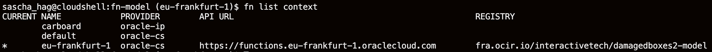
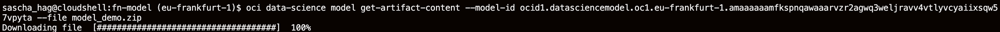
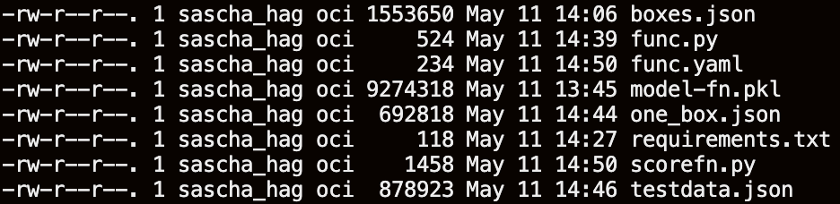
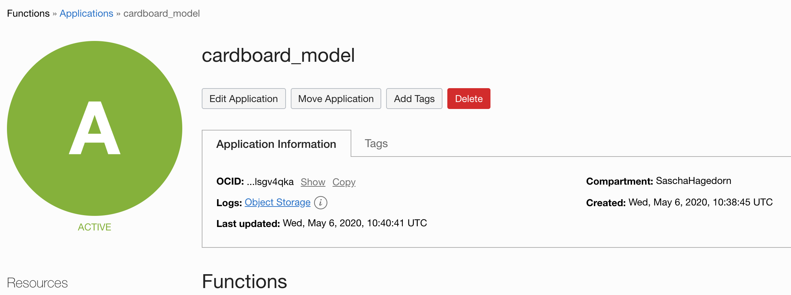
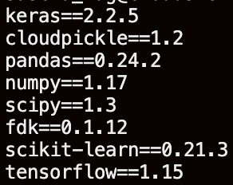
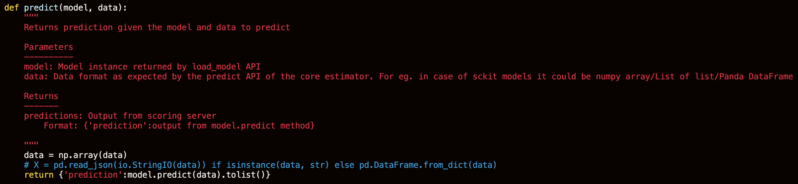
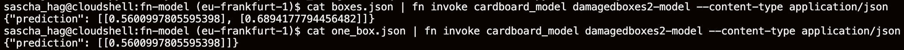

# Cardboard Model Deployment

Open a terminal with FN, Docker and OCIcli installed. I would suggest the CloudShell, because it has all installed and the environment is already authenticated. More infos on the CloudShell [here](https://docs.cloud.oracle.com/en-us/iaas/Content/API/Concepts/cloudshellintro.htm).

Further, you need to create an appropriate context and updated the required parameter. A guide outside of CloudShell can be found [here](https://www.oracle.com/webfolder/technetwork/tutorials/infographics/oci_faas_gettingstarted_quickview/functions_quickview_top/functions_quickview/index.html).

In CloudShell you may only update 
* API url
* Registry

Afterwards, download the model from the model catalog by using the OCID.

Unzip the content. You will have:

* `func.py`
* `scorefunc.py`
* `requirements.txt`
* `func.yaml`

Create an application in Oracle Functions. 

Now add `tensorflow==1.15` to `requirements.txt`. 

Afterwards use FN to deploy your model. 

`fn --verbose deploy --app cardboard_model`

You have two files that represent images in json format. 

* `one_box.json`
* `boxes.json`

In order for the model to understand the json which will be in a list format within the function, you need to transform the list into an array. 

Add the following lines to `score.py`. 

`import numpy as np` at the very top

And `data = np.array(data)` to the `predict` function. 

You can invoke the function and pass along the json by using the following commands:

`cat boxes.json | fn invoke cardboard_model damagedboxes2-model --content-type application/json`

`cat one_box.json | fn invoke cardboard_model damagedboxes2-model --content-type application/json`

